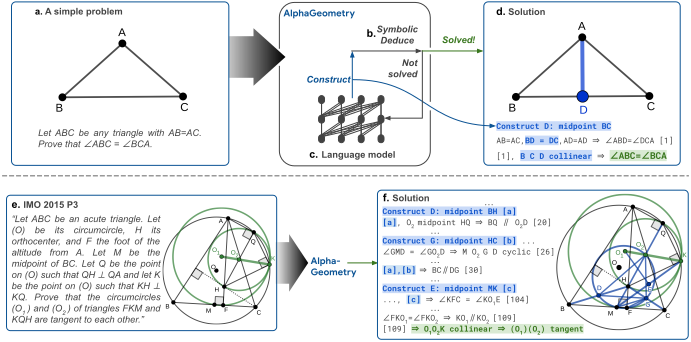

# AlphaGeometryRE

AlphaGeometryRE is a re-engineered version of [AlphaGeometry](https://github.com/google-deepmind/alphageometry) with a
goal to [make](https://github.com/google-deepmind/alphageometry/issues/130)
[it](https://github.com/google-deepmind/alphageometry/issues/116)
[easy](https://github.com/google-deepmind/alphageometry/issues/96) to use (especially on [Windows](https://github.com/google-deepmind/alphageometry/issues/120)):

* Use [ChatLLM.cpp](http://github.com/foldl/chatllm.cpp) for LM inference, no Tensorflow/Jax/Flax.

* Significantly **simplified** _requirements.txt_.

* Indent with **four** spaces (🖕 two spaces).

Plan/Roadmap:

* [x] LM Beam search.

* [ ] Rewrite in Nim.

* [ ] A new description language like [this](https://reference.wolfram.com/legacy/language/v14/guide/PlaneGeometry.html).

* [ ] Catch up with AlphaGeometry2.

## Documentation


--------

# Solving Olympiad Geometry without Human Demonstrations


This repository contains the code necessary to
reproduce DDAR and AlphaGeometry,
the two geometry theorem provers
introduced in the [Nature 2024](https://www.nature.com/articles/s41586-023-06747-5) paper:

*<center>"Solving Olympiad Geometry without Human Demonstrations".</center>*

</br>

<center>

</center>

## Get started

1. Get the source code.

    Either clone this repository or download it.

1. Install ChatLLM.cpp DLLs (or .so whatever).

    You can find prebuilt DLLs in releases. Or, you can [build](https://github.com/foldl/chatllm.cpp/blob/master/docs/binding.md#precondition) `libchatllmb` from source.
    Copy these DLLs into `src/chatllm/bindings`.

1. Install Python dependencies.

    ```sh
    pip install -r requirements.txt
    ```

    Optionally, you can create a virtual environment, and then install dependencies into it.

1. Run `run_tests.bat` to check if everything is Ok.

    The language model will be downloaded automatically.

1. Run `test.bat` to solve a IMO problem with the AlphaGeometry solver.

## Command line flags

A list of command line flags.

* `--mode`: solver selection. (default: `ddar`)

    1. `--mode=ddar`: select the DDAR solver.
    1. `--mode=alphageometry`: select the AlphaGeometry solver.

* `--problems_file`: problem file

    Example: `--problems_file examples\examples.txt`.

* `--problem_name`: name of a problem in the given problem file

    Example: `--problem_name orthocenter`. `orthocenter` is a problem in `examples\examples.txt`.

* `--defs_file` & `--rules_file`: definitions & deduction rules.

    Defaults to `data\defs` & `data\rules.txt` respectively.

* `--batch_size`: beam size of the proof search. (default: 2)

* `--beam_size`: beam size of the proof search. (default: 2)

* `--search_depth`: search depth of the proof search. (default: 2)

NOTE: The results in the paper can be obtained by setting
`--batch_size=32`, `--beam_size=512`, `--search_depth=16`.
But, not confirmed yet.

### Example of DDAR

Below we showed DDAR solver solving IMO 2000 P1:

```batch
python src\alphageometry.py ^
  --problems_file=examples/imo_ag_30.txt ^
  --problem_name=translated_imo_2000_p1
```

Expect the following output

```shell
INFO - translated_imo_2000_p1
INFO - a b = segment a b; g1 = on_tline g1 a a b; g2 = on_tline g2 b b a; m = on_circle m g1 a, on_circle m g2 b; n = on_circle n g1 a, on_circle n g2 b; c = on_pline c m a b, on_circle c g1 a; d = on_pline d m a b, on_circle d g2 b; e = on_line e a c, on_line e b d; p = on_line p a n, on_line p c d; q = on_line q b n, on_line q c d ? cong e p e q
INFO - Depth 1/1000 time = 1.7772269248962402
INFO - Depth 2/1000 time = 5.63526177406311
INFO - Depth 3/1000 time = 6.883412837982178
INFO - Depth 4/1000 time = 10.275688409805298
INFO - Depth 5/1000 time = 12.048273086547852
INFO -
==========================
 * From theorem premises:
A B G1 G2 M N C D E P Q : Points
AG_1 ⟂ AB [00]
BA ⟂ G_2B [01]
G_2M = G_2B [02]
G_1M = G_1A [03]

...
[log omitted]
...

036. ∠QEB = ∠(QP-EA) [46] & ∠(BE-QP) = ∠AEP [55] ⇒  ∠EQP = ∠QPE [56]
037. ∠PQE = ∠EPQ [56] ⇒  EP = EQ

==========================
```

The output first includes a list of relevant premises that it uses,
and then proof steps that gradually build up the proof.
All predicates are numbered to track how they are derived
from the premises, and to show that the proof is fully justified.

TIP: Additionally passing the flag `--out_file=path/to/output/text/file.txt`
will write the proof to a text file.

Running on all problems in `imo_ag_30.txt` will yield solutions to
14 of them, as reported in Table 1 in the paper.

### Example of AlphaGeometry

As a simple example, we load `--problem_name=orthocenter`
from `--problem_file=examples.txt`.
This time, we pass `--mode=alphageometry` to use the AlphaGeometry solver.

```shell
python src/alphageometry.py ^
    --problems_file=examples/examples.txt ^
    --problem_name=orthocenter ^
    --mode=alphageometry ^
    --beam_size=2 ^
    --search_depth=2
```

Expect the following output:

```shell
...
[log omitted]
...
INFO - orthocenter
INFO - a b c = triangle a b c; d = on_tline d b a c, on_tline d c a b ? perp a d b c
INFO - Depth 1/1000 time = 0.009987592697143555 branch = 4
INFO - Depth 2/1000 time = 0.00672602653503418 branch = 0
INFO - DD+AR failed to solve the problem.
INFO - Depth 0. There are 1 nodes to expand:
INFO - {S} a : ; b : ; c : ; d : T a b c d 00 T a c b d 01 ? T a d b c {F1} x00
INFO - Decoding from {S} a : ; b : ; c : ; d : T a b c d 00 T a c b d 01 ? T a d b c {F1} x00
...
[log omitted]
...
INFO - LM output (score=-0.017550): "e : C a c e 02 C b d e 03 ;"
INFO - Translation: "e = on_line e a c, on_line e b d"

INFO - Solving: "a b c = triangle a b c; d = on_tline d b a c, on_tline d c a b; e = on_line e a c, on_line e b d ? perp a d b c"
INFO -
INFO - a b c = triangle a b c; d = on_tline d b a c, on_tline d c a b; e = on_line e a c, on_line e b d ? perp a d b c
INFO - Depth 1/1000 time = 0.021120786666870117
INFO - Depth 2/1000 time = 0.033370018005371094
INFO - Depth 3/1000 time = 0.04297471046447754
INFO -
==========================
 * From theorem premises:
A B C D : Points
BD ⟂ AC [00]
CD ⟂ AB [01]

 * Auxiliary Constructions:
E : Points
E,B,D are collinear [02]
E,C,A are collinear [03]

 * Proof steps:
001. E,B,D are collinear [02] & E,C,A are collinear [03] & BD ⟂ AC [00] ⇒  ∠BEA = ∠CED [04]
002. E,B,D are collinear [02] & E,C,A are collinear [03] & BD ⟂ AC [00] ⇒  ∠BEC = ∠AED [05]
003. A,E,C are collinear [03] & E,B,D are collinear [02] & AC ⟂ BD [00] ⇒  EC ⟂ EB [06]
004. EC ⟂ EB [06] & CD ⟂ AB [01] ⇒  ∠(EC-BA) = ∠(EB-CD) [07]
005. E,C,A are collinear [03] & E,B,D are collinear [02] & ∠(EC-BA) = ∠(EB-CD) [07] ⇒  ∠BAE = ∠CDE [08]
006. ∠BEA = ∠CED [04] & ∠BAE = ∠CDE [08] (Similar Triangles)⇒  EB:EC = EA:ED [09]
007. EB:EC = EA:ED [09] & ∠BEC = ∠AED [05] (Similar Triangles)⇒  ∠BCE = ∠ADE [10]
008. EB:EC = EA:ED [09] & ∠BEC = ∠AED [05] (Similar Triangles)⇒  ∠EBC = ∠EAD [11]
009. ∠BCE = ∠ADE [10] & E,C,A are collinear [03] & E,B,D are collinear [02] & ∠EBC = ∠EAD [11] ⇒  AD ⟂ BC
==========================

INFO - Solved.
```

NOTE: Point `H` is automatically renamed to `D`,
as the LM is trained on synthetic problems
where the points are named alphabetically, and so it expects
the same during test time.

As can be seen in the output, initially DDAR failed to solve the problem.
The LM proposes two auxiliary constructions (because `--batch_size=2`):

* `e = on_line e a c, on_line e b d`, i.e.,
`E` is the intersection of `AC` and `BD`.
This construction has a score of `-0.017550`.

* `e = eqdistance e c a b, eqdistance e b a c`, i.e.,
construct `E` as the intersection of circle (center=C, radius=AB) and
circle (center=B, radius=AC). This construction has a lower score (`-4.05149`)
than the previous.

Since the first construction has a higher score, DDAR attempted it first and
found the solution right away. The proof search therefore terminates and
there is no second iteration.

## Source code description

Files in this repository include python modules/scripts to run the solvers and
resource files necessary for the script to execute. We listed below
each of them and their description.

| File name              | Description                                                                        |
|------------------------|------------------------------------------------------------------------------------|
| `geometry.py`          | Implements nodes (Point, Line, Circle, etc) in the proof state graph.              |
| `numericals.py`        | Implements the numerical engine in the dynamic geometry environment.               |
| `graph_utils.py`       | Implements utilities for the proof state graph.                                    |
| `graph.py`             | Implements the proof state graph.                                                  |
| `problem.py`           | Implements the classes that represent the problem premises, conclusion, DAG nodes. |
| `dd.py`                | Implements DD and its traceback.                                                   |
| `ar.py`                | Implements AR and its traceback.                                                   |
| `trace_back.py`        | Implements the recursive traceback and dependency difference algorithm.            |
| `ddar.py`              | Implements the combination DD+AR.                                                  |
| `lm_inference.py`      | Implements an interface to a trained LM to perform decoding.                       |
| `alphageometry.py`     | Main script that loads problems, calls DD+AR or AlphaGeometry solver, and prints solutions.   |
| `pretty.py`            | Pretty formating the solutions output by solvers.                                  |
| `test_xx.py`           | Tests for the corresponding module.                                                |
| `run.sh`/`run.bat`     | Script to run a demo in README.                                                    |
| `run_tests.sh`/`run_tests.bat` | Script to execute the test suite.                                          |


Resource files:

| Resource file name     | Description                                                                        |
|------------------------|------------------------------------------------------------------------------------|
| `data/defs.txt`             | Definitions of different geometric construction actions.                      |
| `data/rules.txt`            | Deduction rules for DD.                                                       |
| `examples/imo_ag_30.txt`    | Problems in IMO-AG-30.                                                        |
| `examples/jgex_ag_231.txt`  | Problems in JGEX-AG-231.                                                      |

## Original AlphaGeometry License Information

### Code License

Copyright 2023 DeepMind Technologies Limited

All software is licensed under the Apache License, Version 2.0 (Apache 2.0);
you may not use this file except in compliance with the Apache 2.0 license.
You may obtain a copy of the Apache 2.0 license at:
https://www.apache.org/licenses/LICENSE-2.0

All other materials are licensed under the Creative Commons Attribution 4.0
International License (CC-BY). You may obtain a copy of the CC-BY license at:
https://creativecommons.org/licenses/by/4.0/legalcode

Unless required by applicable law or agreed to in writing, all software and
materials distributed here under the Apache 2.0 or CC-BY licenses are
distributed on an "AS IS" BASIS, WITHOUT WARRANTIES OR CONDITIONS OF ANY KIND,
either express or implied. See the licenses for the specific language governing
permissions and limitations under those licenses.

### Model Parameters License

The AlphaGeometry checkpoints and vocabulary are made available
under the terms of the Creative Commons Attribution 4.0
International (CC BY 4.0) license.
You can find details at:
https://creativecommons.org/licenses/by/4.0/legalcode

